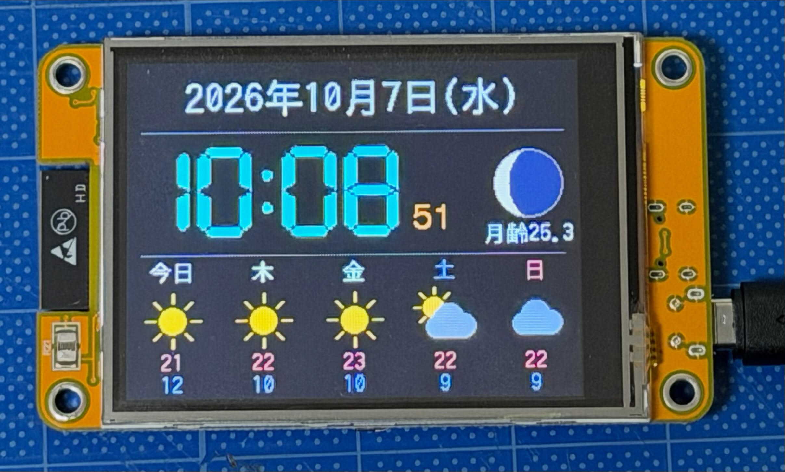

# CYD を使用した卓上時計（月齢と天気予報付き）

CYD（Cheap Yellow Display）は、ESP32マイクロコントローラーとタッチスクリーン付きカラー液晶が一体になった、非常に安価で人気の電子工作向け開発ボードです。

これを利用して、卓上時計を表示するプログラムです。

## 補足
* 天気：Open-Meteo から取得します。30分ごとに更新し、日付が変わった時にも更新します。失敗した場合は1分後に再試行します。アイコンは画像ファイルではなく、図形を描いて作っています（晴れ、晴れ時々曇り、曇り、霧、雨、雪、雷）。
* 地点：初期値は盛岡市です。変更する場合は include/config.h の WEATHER_LATITUDE と WEATHER_LONGITUDE を書き換えてください。
* 月齢：平均朔望月（29.53日）からの計算です。日本の暦と同じく、その日の正午の月齢です。実際の月齢と最大で半日ほどずれることがあります。満ちていく間は右側が明るくなります。
* 秒表示：天気取得中は通信のため、数秒間だけ秒表示が止まります。
